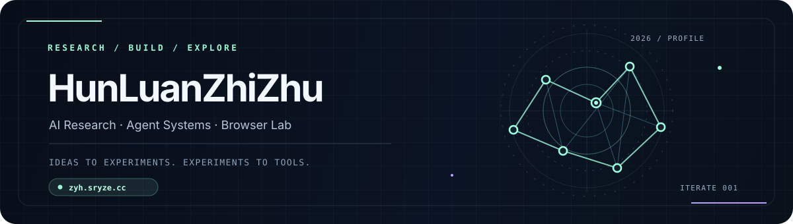

> [!NOTE]
> This profile was summarized by **ChatGPT** from my GitHub repositories. It may contain simplifications or imperfect interpretations of my work.

 

  

**AI research · optimization · agent infrastructure · browser experiments**

---

## 🧪 Browser Lab — my main public showcase

> **https://zyh.sryze.cc/**  
> GitHub Pages fallback: https://hunluanzhizhu.github.io/

My personal site is not a conventional portfolio page. It is a **browser-native laboratory** where research artifacts, interactive experiments, graphics, games, AI-assisted creations, and small applications are published as things you can actually open and use.

The site itself is deliberately lightweight: a static, framework-free front page with inline CSS / JavaScript / fonts, while individual experiments live under <code>/projects/</code>.

<table>
<tr>
<td width="50%" valign="top">

### 🧱 Minecraft Web
**Rust · Bevy · WebAssembly**

A browser-based 3D sandbox experiment compiled to WASM.

[Open project →](https://zyh.sryze.cc/projects/minecraft-web/)

</td>
<td width="50%" valign="top">

### 📚 Group Meeting PPTs
**Slides · KaTeX · SVG · WebGL**

Research presentations published directly as browser experiences, with a dedicated session index.

[Open project →](https://zyh.sryze.cc/projects/group-meeting-ppts/)

</td>
</tr>
<tr>
<td width="50%" valign="top">

### 🎮 AI Game Studio Eval
**Benchmark · Godot · WASM**

A browser-published evaluation of AI-generated games and game-building workflows.

[Open project →](https://zyh.sryze.cc/projects/game-studio-eval-s2/)

</td>
<td width="50%" valign="top">

### ❤️ ECG AI Local
**TensorFlow.js · SNN · Local AI**

A browser-local ECG / AI experiment exploring client-side inference and neural modeling ideas.

[Open project →](https://zyh.sryze.cc/projects/ecg-ai-local/)

</td>
</tr>
<tr>
<td width="50%" valign="top">

### 🎛️ Liang Intensity Calibrator
**AI · Video · Canvas**

An interactive calibration experiment combining AI-generated material, video, and browser graphics.

[Open project →](https://zyh.sryze.cc/projects/liang-intensity-calibrator/)

</td>
<td width="50%" valign="top">

### ✨ Open Design Test
**WebGL2 · Shader · Interactive Design**

A browser graphics experiment centered on procedural visuals, interaction, and shader-driven effects.

[Open project →](https://zyh.sryze.cc/projects/open-design-test/)

</td>
</tr>
</table>

[**Explore the full Browser Lab →**](https://zyh.sryze.cc/)

The homepage is also part of the experiment: project filtering and search, Chinese / English switching, procedural visuals, WebGL effects, motion controls, responsive layouts, keyboard navigation, and small interaction details are all implemented directly in the page.

---

## 🔬 What I build

<table>
<tr>
<td width="33%" valign="top">

### Research
Optimization algorithms, reinforcement learning, spiking neural networks, paper reproduction, experimental model ideas.

</td>
<td width="33%" valign="top">

### Agent Systems
Reusable agent skills, automated research / coding workflows, model API infrastructure, workspace tooling.

</td>
<td width="33%" valign="top">

### Browser Engineering
WebAssembly, WebGL, Canvas, SVG, browser-native demos, games, interactive research presentations.

</td>
</tr>
</table>

**paper → mechanism → reproduction → modification → experiment → engineering → automation**

---

## 🚀 Representative repositories

<table>
<tr>
<td width="50%" valign="top">

### [AdaNCFGD](https://github.com/HunLuanZhiZhu/AdaNCFGD)
Adaptive fractional gradient-descent optimizers with PyTorch integration and a spiking-neural-network framework.

<code>optimization</code> · <code>PyTorch</code> · <code>SNN</code> · <code>research software</code>

</td>
<td width="50%" valign="top">

### [mini-proxy](https://github.com/HunLuanZhiZhu/mini-proxy)
A lightweight Rust proxy for OpenAI-style, Anthropic-style, and Responses-style model APIs, with streaming, retries, mapping, and request adaptation.

<code>Rust</code> · <code>AI API</code> · <code>SSE</code> · <code>infrastructure</code>

</td>
</tr>
<tr>
<td width="50%" valign="top">

### [.agents](https://github.com/HunLuanZhiZhu/.agents)
My reusable AI-agent skills and workflow layer: behavior rules, skill organization, version locking, and research / productivity tooling.

<code>agents</code> · <code>skills</code> · <code>automation</code> · <code>workflow</code>

</td>
<td width="50%" valign="top">

### [Auto-zcode-research-in-sleep](https://github.com/HunLuanZhiZhu/Auto-zcode-research-in-sleep)
An experiment around automating research and coding workflows with AI agents.

<code>agents</code> · <code>research automation</code> · <code>coding</code>

</td>
</tr>
<tr>
<td width="50%" valign="top">

### [ZCode-Game-Studios](https://github.com/HunLuanZhiZhu/ZCode-Game-Studios)
AI-assisted game creation and evaluation work, connected to the public browser demos in my Browser Lab.

<code>AI</code> · <code>games</code> · <code>evaluation</code>

</td>
<td width="50%" valign="top">

### [liang-intensity-calibrator](https://github.com/HunLuanZhiZhu/liang-intensity-calibrator)
An interactive AI-related calibration project also published as a live browser experience.

<code>AI</code> · <code>interaction</code> · <code>Canvas</code> · <code>video</code>

</td>
</tr>
</table>

---

## 🧰 Stack & tools

---

## 🧭 Current direction

### researching AI systems  
↓  
### building AI systems that help me research, code, experiment, and create

The website is the visual surface of that process; the repositories hold the underlying algorithms, agent workflows, infrastructure, and experiments.

---

Profile text summarized by <b>GPT-5.6 Sol on the ChatGPT web app</b> from the GitHub repositories of <b>HunLuanZhiZhu</b>. 
Mirrors, clones, and non-representative repositories are intentionally excluded from the core-project summary.

