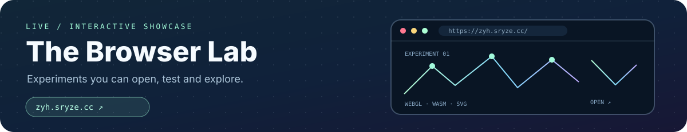
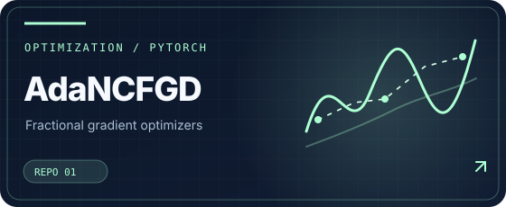
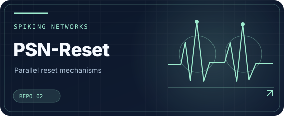
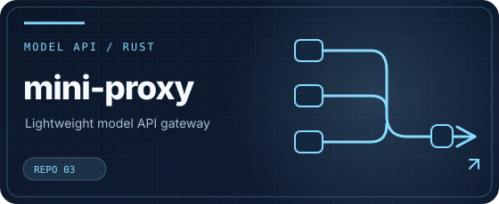
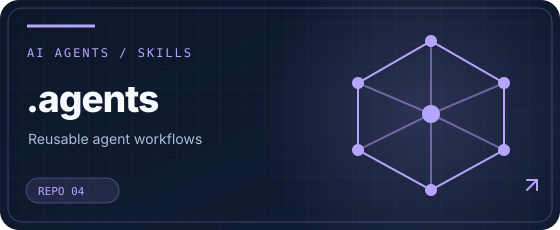
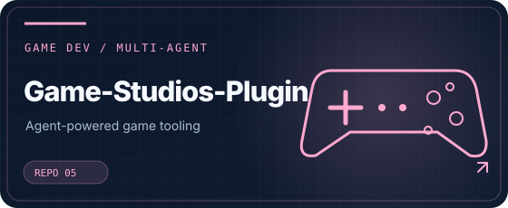
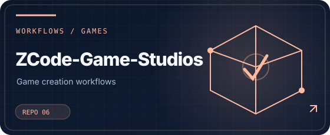
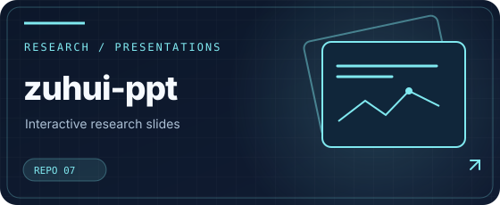
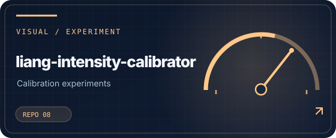

> [!NOTE]
> **由 AI 根据我的 GitHub 项目整理** · 整理模型说明：**GPT-6.1 Sol**。内容为项目方向的概括，可能存在简化或遗漏；私有项目仅公开名称。

**让想法有实验，让实验变成工具。**

## 关于我

我是 **HunLuanZhiZhu**，一名关注人工智能研究与工程实践的研究生。主要探索优化算法、强化学习、脉冲神经网络、智能体系统与浏览器交互实验。

相比单纯介绍技术，我更愿意展示**可验证的研究、可运行的原型和可复用的工具**。

## 浏览器实验室

研究可视化、图形交互、小游戏与实用工具持续发布于 **[zyh.sryze.cc](https://zyh.sryze.cc/)**。公开站点源码：[hunluanzhizhu.github.io](https://github.com/HunLuanZhiZhu/hunluanzhizhu.github.io)。

## 公开项目 · 可直接访问

每张项目图卡均可点击，进入对应的公开 GitHub 仓库。

<table>
<tr>
<td width="50%" valign="top">

 自适应分数阶梯度优化研究。
</td>
<td width="50%" valign="top">

 脉冲神经网络并行重置机制。
</td>
</tr>
<tr>
<td width="50%" valign="top">

 大模型接口代理、流式转发与请求适配。
</td>
<td width="50%" valign="top">

 可复用的智能体技能与研究工作流。
</td>
</tr>
<tr>
<td width="50%" valign="top">

 多角色协作的智能体游戏开发插件。
</td>
<td width="50%" valign="top">

 面向 ZCode 的游戏开发工作流。
</td>
</tr>
<tr>
<td width="50%" valign="top">

 研究组会演示与网页展示。
</td>
<td width="50%" valign="top">

 视频与图形交互校准实验。
</td>
</tr>
</table>

## 私有项目 · 仅展示名称

以下内容**只列项目名称**；不提供链接、代码、实现细节或项目进展。

<code>MaxFormer</code> &nbsp;·&nbsp; <code>Guon</code> &nbsp;·&nbsp; <code>alo-marl-fs</code> &nbsp;·&nbsp; <code>math-modeling-skills</code> &nbsp;·&nbsp; <code>pnn</code> &nbsp;·&nbsp; <code>mems</code> &nbsp;·&nbsp; <code>MUD3</code> &nbsp;·&nbsp; <code>rl-fs</code> &nbsp;·&nbsp; <code>MinimalWorldModel</code>

---

研究路径：提出问题 → 复现验证 → 方法改进 → 工程实现 → 自动化迭代

